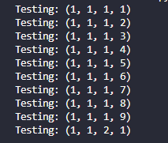

# Parental Control Cracker

> The project is a method to crack the parental control password from a Samsung TV.

### Adjustments and Improvements

The project is still under development and upcoming updates will be detailed in the following tasks:

- [ ] Work with my SamsungTV-Wrapper

## 💻 Prerequisites

Before you begin, make sure you meet the following requirements:
* You have installed the latest version of `Python3`
* You have installed the `requirements.txt`.

## 🚀 Installing Parental Control Cracker

To install the project follow this steps:

* Click in `Code`;
* Click in `Download ZIP`;
* Extract the project;

OR

* Open terminal
* Run the command `git clone https://github.com/gabriel-preti-ferraz/Parental-Control-Cracker`

## ☕ Using Parental Control Cracker

To use the project, follow this steps.

* Fill the `.env` file with the required data;
* Adapt the code to the format of your TV interface;
* Run `main.py`;

## 📫 Contributing to the project
To contribute to the Parental Control Cracker follow these steps:

1. Fork this repository.
2. Create a branch: `git checkout -b <branch_name>`.
3. Make your changes and commit them: `git commit -m '<commit_message>'`
4. Push to the original branch: `git push origin <project_name> / <local>`
5. Create the pull request.

Alternatively, see the GitHub documentation at
[how to create a pull request](https://help.github.com/en/github/collaborating-with-issues-and-pull-requests/creating-a-pull-request).

## 🤝 Collaborators

We would like to thank the following people who contributed to this project:

<table>
  <tr>
    <td align="center">
      <a href="https://github.com/gabriel-preti-ferraz/">
         
        
          <b>Gabriel Preti Ferraz</b>
        
      </a>
    </td>
    <td align="center">
      <a href="https://github.com/xEricL">
         
        
          <b>xEricL</b>
        
      </a>
    </td>
    </td>
  </tr>
</table>

## 📝 License

This project is licensed under MIT. See the file [LICENSE](LICENSE.md) for more details.

[⬆ Back to top](#parental-control-cracker) 
